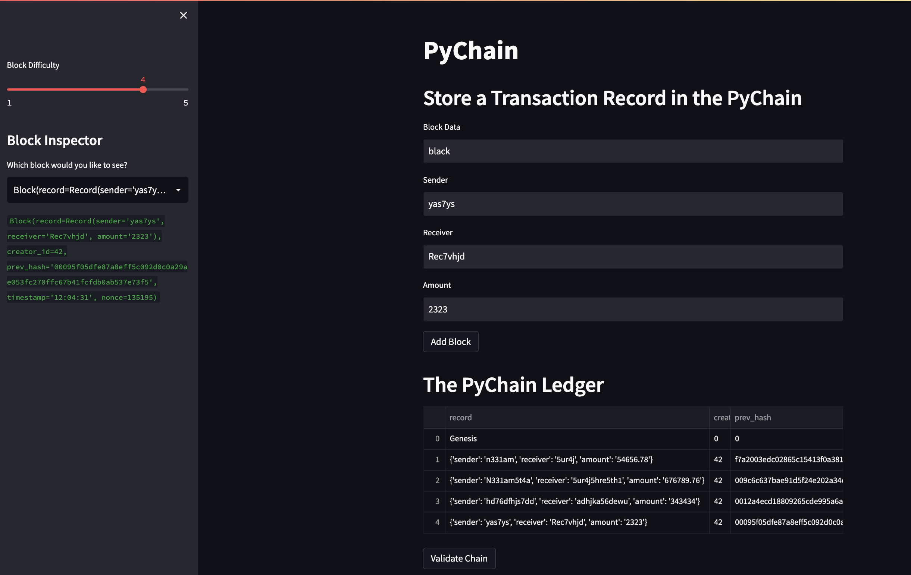

# PyChain Ledger

## Description
In this project, I have build a blockchain-based ledger system, completer with a user friendly web interface using streamlit. This legder allows partner banks to conduct financial transactions (that ism to transfer money between senders and receivers) and to verify the integrity of the data in the ledger.

## Libraries
I have used stramlit, dataclasses, typing, datetime, pandas and hashlib libraries for this project.

## Running Streamlit Web Interface
1. In the terminal, navigate to the folder where `pychain.py` is stored.

2. In the terminal, run the Streamlit application by using `streamlit run pychain.py`.

3. Enter values for the sender, receiver, and amount, and then click the "Add Block" button. You can do this several times to store several blocks in the ledger. You can even toggle the block difficulty with the slider on the lefthand side of the web interface.

4. Verify the block contents and hashes in the Streamlit dropdown menu.

5. Test the blockchain validation process by clicking the 'Validate Chain' button.

# Pychain Stramlit Demo
For video demo of the streamlit web interface, download `pychaindemo.mov` in this repository.

# PyChain Streamlit Web Interface Screenshot
